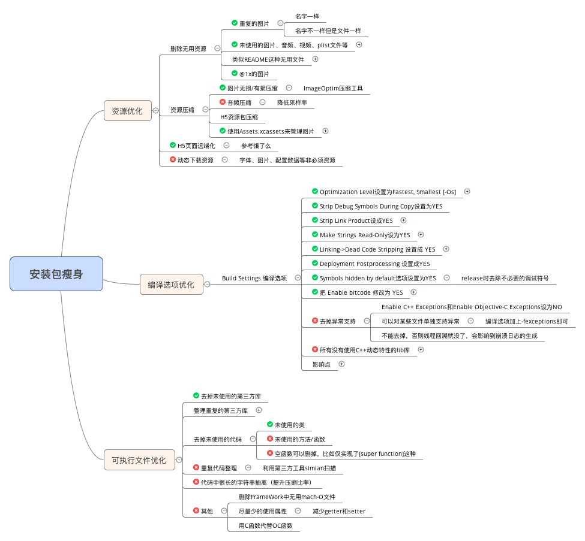

## 掘金iOS端体积瘦身 (2017年9月份)

-  **5.1.2版本上线前做了一小部分工作后(pics):** **4.7及以下尺寸机型体积为50.3mb**,**5.5尺寸机型体积为62.2mb**
- **目标 :** **4.7及以下尺寸机型体积为43.2mb**,**5.5尺寸机型体积为52.4mb**

## tool 
- [检查每个类占用空间大小工具](https://github.com/huanxsd/LinkMap)
- [解压APP 包中图片资源Assets.car](https://github.com/devcxm/iOS-Images-Extractor)
- [未使用图片资源辅助工具](https://github.com/tinymind/LSUnusedResources)
- [TinyPNG的Mac客户端](https://github.com/kyleduo/TinyPNG4Mac)

##  ARM了解

- ARMv6：ARM11内核用于iPhone2G和iPhone3G中的架构
- ARMv7：modern ARM内核用于iPhone3GS和iPhone4/S中的架构
- ARMv7s：A6内核用于iPhone5中的架构
- ARM64：A7内核用于iPhone5S/C中的架构
- 之前的支持 (arm64 armv7 armv7s）（删除 armv7）

## 常见方式
- Architectures: armv7 and arm64  ,移除对**iphone5**以下机型的支持
- Assets: 项目中收藏集版本图片占比75%,大图采取`tinyPNG`压缩.
- pics: 项目中早前的图片资源整合/重复图片删除...  
- code: 负责对早前无用的类清理    

